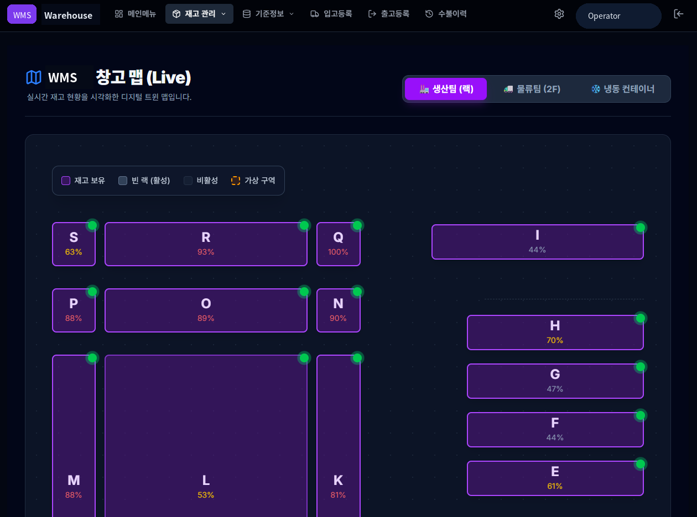
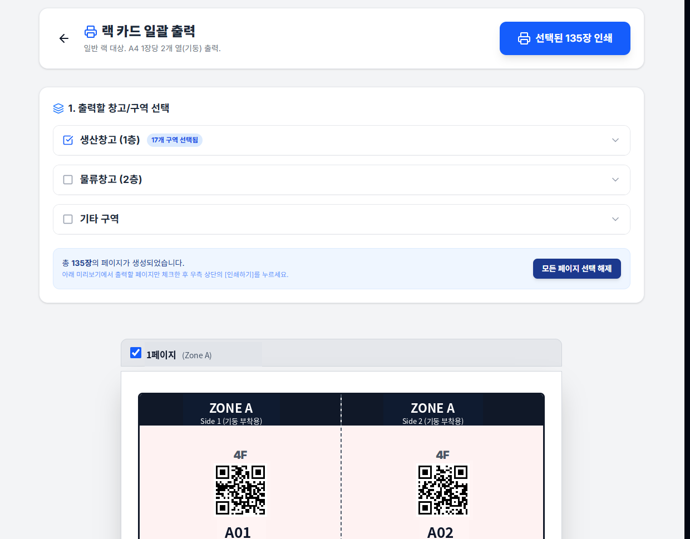
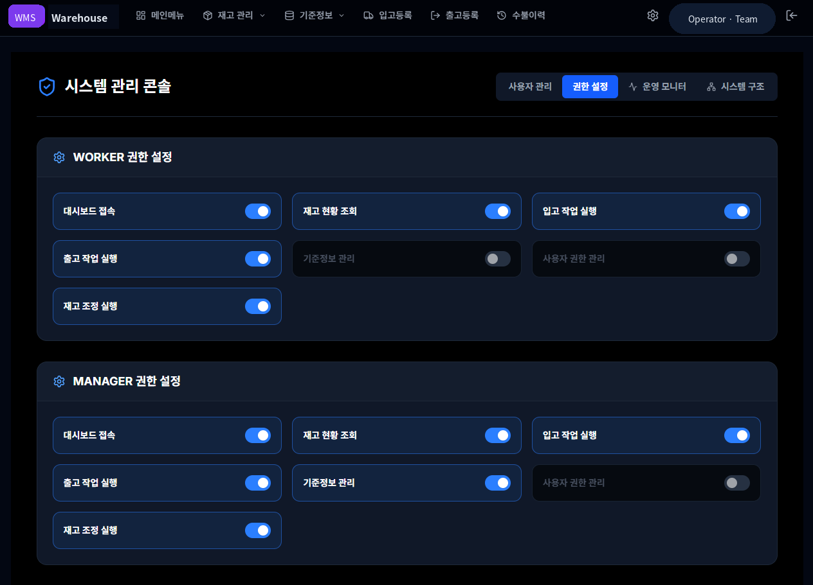
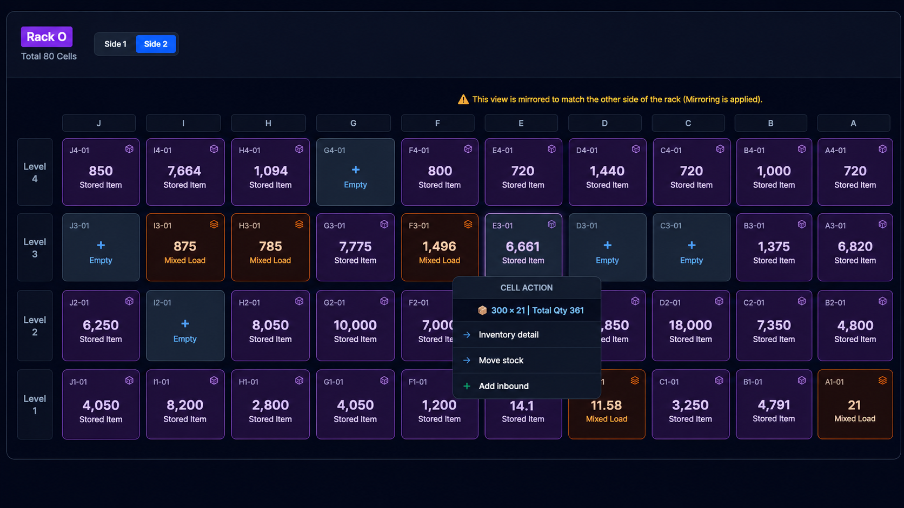
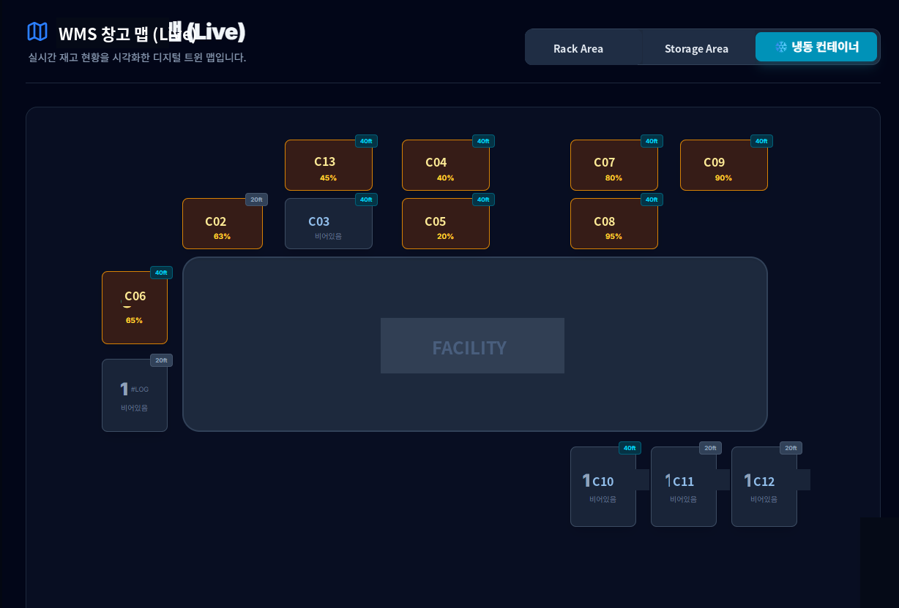
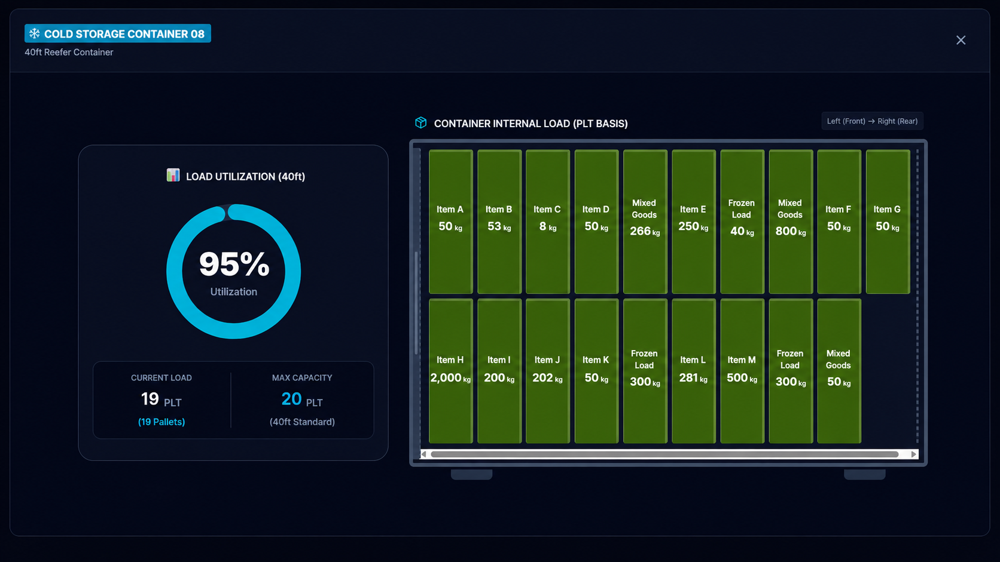
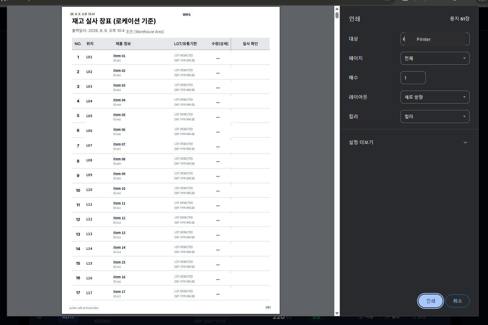

# WMS-001 — Operational Warehouse Management System

**Status:** Canonical FORGE Case v0.3 — evidence-backed; sanitized visual evidence incrementally committed and integrity-verified

## 1. Case at a Glance

WMS-001은 수동 warehouse/location 문제에서 출발해 QR + AppSheet 기반의 첫 executable hypothesis를 거친 뒤, custom web architecture로 전환하고 physical warehouse, inventory, transaction, permission, QR, digital map을 하나의 operating system으로 연결한 deployed multi-user WMS 사례다.

| Case Status | Evidence |
| --- | --- |
| Built | Confirmed |
| Deployed | Confirmed |
| Operational Use | Confirmed |
| Multi-user Operation | Confirmed |
| Physical-Digital Mapping | Confirmed |
| Public Sanitized Visual Evidence | Confirmed — 6 assets integrity-verified |
| Public Visual Derivatives | Confirmed — 2 assets integrity-verified |
| Measured Business Impact | Not Yet Established |

이 Case의 핵심은 기능 수가 아니라 **현장 문제를 어떻게 구조화하고, 어떤 architecture decision을 거쳐, 실제 운영 시스템으로 발전시켰는가**에 있다.

<!-- Visual candidate: sanitized warehouse map hero -->

---

## 2. The Problem

출발점은 기술 도입이 아니었다. 현장의 위치·품목·재고 상태를 **더 신뢰 가능하고 빠르게 확인·운영해야 하는 문제**가 있었다.

초기 Ground Truth는 다음과 같이 일반화할 수 있다.

- manual rack-card dependency
- location / item mismatch
- inventory search friction
- physical / system inventory reconciliation burden
- stock count / closing 시 추가 검증 부담

사람이 창고를 직접 돌아다니거나 다른 사람에게 물어 위치와 재고를 확인하는 방식은 운영 규모가 커질수록 더 많은 확인 비용과 불확실성을 만들었다.

WMS-001은 이 문제를 software feature의 집합이 아니라 **physical warehouse state를 신뢰 가능한 digital operating model로 연결하는 문제**로 다루기 시작했다.

---

## 3. From First Hypothesis to Custom WMS

초기 solution은 가능한 한 빠르게 현장 개념을 실행해보는 방향이었다.

```text
Location QR
+ Item QR
+ AppSheet
+ Google Sheets
+ PC Lookup
```

> **AppSheet was the first executable hypothesis.**

AppSheet는 실패한 기술이 아니었다. QR workflow, data model, mobile interaction, 현장 사용 방식을 빠르게 구체화하고 검증하기 위한 첫 실행 가능한 접근이었다.

초기 data model은 Location / Item / Transaction을 분리하는 구조였다.

```text
Location
Item
Transaction
```

당시 engineering concept에는 `LOC_MASTER`, `ITEM_MASTER`, `STOCK_TX`와 같은 구조가 존재했고, 이 모델은 이후 architecture가 바뀐 뒤에도 문제를 구조화하는 출발점 역할을 했다.

요구 범위가 커지면서 더 높은 UX control, performance, deployment flexibility, extensibility가 필요해졌고 custom web architecture로 전환했다.

```text
AppSheet
→ Next.js
→ Supabase / PostgreSQL
→ Git
→ Vercel
```

이 pivot은 WMS의 시작점이 아니다. 이미 존재하던 field problem, data model, executable hypothesis를 **더 확장 가능한 operational architecture로 옮긴 시점**이다.

현재 source에서 확인되는 주요 기술 구성은 다음과 같다.

- Next.js
- React
- TypeScript
- Supabase / PostgreSQL
- authentication / authorization
- transaction history
- QR interaction
- responsive / mobile operation

production URL, project identifier, private endpoint와 같은 실제 운영환경 식별자는 공개하지 않는다.

<!-- Visual candidate: sanitized initial QR/AppSheet concept -->

---

## 4. The Operating System

현재 WMS는 warehouse operation을 다음 흐름으로 연결한다.

```text
Inbound
→ Inventory
→ Movement
→ Outbound
→ Transaction History
```

이 core flow 주변에서 master data, inventory adjustment, stocktake / reconciliation, authentication, role / feature permission, QR interaction이 운영 통제 역할을 한다.

중요한 점은 transaction이 단순 CRUD에 머물지 않는다는 것이다. current source에서 inbound workflow는 location, LOT, packing, business rules를 다루고, inventory movement는 partial / full / merge handling과 packing-information preservation을 포함한다.

즉, 시스템은 “재고를 옮긴다”는 단순 동작보다 **현장의 실제 물류 상태와 packaging constraint를 보존하면서 이동을 기록하는 것**에 가까워졌다.

role / feature permission 역시 별도의 control layer다. 사용자 역할에 따라 inventory, inbound, outbound, master, adjustment, user-control 등 접근 가능한 기능을 분리하며, operational history는 transaction record로 축적된다.

---

## 5. Physical ↔ Digital Warehouse

WMS-001의 핵심 engineering idea 중 하나는 physical warehouse와 digital inventory model을 직접 연결하는 것이다.

```text
Physical Location
→ Managed Location Identity
→ QR / Rack Card
→ Transaction
→ Inventory
→ Digital Map
```

location은 단순 문자열이 아니라 managed master data로 다뤄진다. zone, rack, level, side와 같은 구조적 속성을 기반으로 physical storage를 digital identity로 표현하고, 그 identity를 QR / rack card와 연결한다.

이 모델은 다음 operational capability로 확장되었다.

- location master / builder
- QR / rack-card physical interface
- warehouse map / occupancy visualization
- mixed-stock location view
- standard rack뿐 아니라 deep-lane / freezer-container 등 heterogeneous storage topology 지원

특히 Side 2는 database coordinate를 그대로 화면에 그리는 대신 작업자의 실제 관찰 방향을 반영해 좌우 배열을 뒤집는 UI decision이 존재한다.

```text
Database Coordinate
→ Physical Rack Geometry
→ Operator Viewpoint
→ Mirrored UI
```

이것은 시각적 장식이 아니라 **digital representation을 physical operator viewpoint에 맞추는 domain-specific decision**이다.

정확한 location code, rack coding scheme, QR payload는 public MILES에 포함하지 않는다.

<!-- Visual candidates: sanitized rack card, warehouse map, Side-2 mirroring -->

---

## 6. How It Evolved

현재 chronology는 다음 수준으로 정리한다.

```text
2025-11
Initial field problem / data model
→
2026-01
Architecture pivot
→
2026-02
V1 operational baseline
→
2026-02~03
Operational-fit evolution
→
2026-03
Management / control expansion direction
```

2025-11에는 field problem, QR/AppSheet hypothesis, Location / Item / Transaction data model이 형성되었다.

2026-01에는 AppSheet-era concept이 custom web architecture로 이동했다.

2026-02에는 inbound, inventory movement, outbound, master data, transaction history, authentication / authorization, permission control, UAT 등을 포함하는 operational baseline이 형성된 것으로 현재 chronology가 지지한다.

이후 inventory adjustment, QR, mobile operation, bulk inbound / outbound, movement sophistication 같은 기능이 실제 운영 적합성을 높이는 방향으로 누적되었다. 2026-03에는 dashboard, KPI, traceability, alert, location optimization 등 management / control capability로의 확장 방향도 나타났다.

> **Complexity accumulated through verified increments.**

이 문장은 Git history와 current source에 의해 **Strongly Supported working observation**이다. 다만 이를 formal methodology로 선언하지 않는다.

V1 / V2 / V2.5의 모든 공식 boundary가 완전히 확정된 것으로 표현하지도 않는다. 상세 chronology와 unresolved version questions는 `bridge/WMS_CASE_RESEARCH_NOTE.md`가 관리한다.

---

## 7. Operator Role

이 프로젝트에서 human operator의 역할은 모든 코드를 직접 작성하는 것이 아니라 **문제, 규칙, architecture, operational verification에 대한 통제권을 유지하는 것**에 가까웠다.

현재 evidence가 지지하는 범위에서 다음 역할을 기록할 수 있다.

- framed the warehouse problem from field operations
- defined the initial Location / Item / Transaction model
- formed the first QR / AppSheet solution hypothesis
- evaluated limitations and drove the architecture pivot
- directed feature-by-feature implementation
- exercised and verified operational behavior
- expanded the system as new field constraints emerged

역할을 단순화하면 다음과 같다.

```text
Human-controlled
Problem framing
Business rules
Architecture decisions
Operational verification

AI-assisted
Implementation
```

이는 “모든 feature가 동일한 AI workflow로 생성되었다”거나 “인간이 모든 코드를 직접 작성했다”는 의미가 아니다.

현재 `Domain-Grounded Incremental AI Development`라는 표현을 working characterization으로 사용할 수 있지만, 이는 아직 MILES `METHODS`로 승격된 formal method가 아니다.

---

## 8. Operational Evidence & Impact

현재 WMS-001에서 확인된 operational evidence는 다음과 같다.

- implemented system
- production deployment
- authenticated application
- operational transaction history
- multi-user / role operation
- role / feature permission
- physical-digital mapping
- rack-card / QR output
- heterogeneous storage-model expansion
- first sanitized transaction-history visual evidence committed with exact-byte read-back verification
- sanitized warehouse-map visual evidence committed with exact-byte read-back verification
- sanitized rack-card bulk-print visual evidence committed with exact-byte read-back verification
- sanitized role / permission visual evidence committed with exact-byte read-back verification
- sanitized cold-storage overview visual evidence committed with exact-byte read-back verification
- sanitized stocktake-print visual evidence committed with exact-byte read-back verification

### Observed

현재 evidence로 관찰 가능한 변화:

- manual lookup 중심에서 system-based location lookup으로 이동
- physical warehouse가 managed digital location model로 전환
- transaction / history가 system record로 축적
- inventory / location / permission이 하나의 operating system 안에 연결

### Measured

현재 public하게 사용할 수 있는 validated quantitative metric은 없다.

### Not Yet Measured

- ROI
- time saving
- inventory accuracy improvement
- search-time reduction
- labor reduction

숫자를 새로 만들거나 추정하지 않는다.

transaction history, warehouse map, rack-card bulk print, role / permission, cold-storage overview, stocktake print은 public **Sanitized Evidence**로 repository에 존재한다. remaining private original visual evidence에는 production deployment, authenticated application, original Side 2 mirroring screenshot, original cold-storage detail screenshot, other unpublished operational screenshots 등이 포함되며, public MILES에는 향후 선별된 visual evidence만 개별 sanitization / publication review 후 추가할 계획이다.

### First Public Sanitized Visual Evidence


이 visual evidence는 실제 operational transaction-history screenshot을 기반으로 하며, sensitive values는 repository publication 이전에 sanitization되었다. 따라서 Public Visual Derivative가 아니라 **Sanitized Evidence**로 분류한다.

repository transport에서는 regenerate, resize, recompress, format conversion, metadata editing을 수행하지 않았다.

| Field | Verified Value |
| --- | --- |
| Source size | `128360` bytes |
| Source SHA-256 | `1eafaeea9f7c57873060e93529786a4da8072e1518b26978869e8af8943026cf` |
| Expected Git blob SHA | `72d42e479ea5af9c82a3c6578c7a45f569dca549` |
| Resulting Git blob SHA | `72d42e479ea5af9c82a3c6578c7a45f569dca549` |
| Read-back size | `128360` bytes |
| Read-back SHA-256 | `1eafaeea9f7c57873060e93529786a4da8072e1518b26978869e8af8943026cf` |
| Integrity verified | `true` |
| Evidence commit | `a6ce0bd1bafbdd26a2d478feab94b7473446553a` |

이 integrity validation은 sanitized asset의 source bytes와 repository read-back bytes가 동일함을 검증한 것이다.

이 검증 자체가 다음을 새롭게 증명하는 것은 아니다.

- business impact
- operational effectiveness
- ROI
- time saving
- inventory accuracy improvement

### Second Public Sanitized Visual Evidence — Warehouse Map



이 visual evidence는 실제 operational warehouse-map screenshot을 기반으로 하며, publication 이전에 minimal sanitization을 수행했다. personal identity / exact team identity와 internal system codename만 generalize했고, rack identifiers, rack utilization percentages, warehouse topology, map geometry, occupancy-state colors, functional UI는 보존했다. 따라서 regenerated derivative가 아니라 **Sanitized Evidence**로 분류한다.

repository transport에서는 regenerate, resize, crop, recompress, format conversion, metadata editing을 수행하지 않았다.

| Field | Verified Value |
| --- | --- |
| Source size | `84411` bytes |
| Source SHA-256 | `9436d0ead8260d125f7196b699c4537306b078320444574b9bb2baf91509f123` |
| Expected Git blob SHA | `3f50d3742a60faad6d51ffdb847db3fe73603ff7` |
| Resulting Git blob SHA | `3f50d3742a60faad6d51ffdb847db3fe73603ff7` |
| Read-back size | `84411` bytes |
| Read-back SHA-256 | `9436d0ead8260d125f7196b699c4537306b078320444574b9bb2baf91509f123` |
| Integrity verified | `true` |
| Evidence commit | `af825eda43ad04b5ced988334287c162797b5ba1` |

이 evidence가 직접 지지하는 것은 다음 범위다.

- physical-digital warehouse mapping
- rack-level occupancy visualization
- heterogeneous warehouse topology representation

이 evidence와 exact-byte integrity verification 자체가 다음을 새롭게 증명하는 것은 아니다.

- business impact
- ROI
- time saving
- inventory accuracy improvement
- productivity improvement

### Third Public Sanitized Visual Evidence — Rack Card Bulk Print



이 visual evidence는 실제 operational rack-card bulk-print screenshot을 기반으로 하며, repository publication 이전에 minimal sanitization을 수행했다. detailed rack / row coding과 exact internal location identifiers는 generalize했고, original QR payloads는 deterministic public-safe QR payloads로 replace했다. bulk-print workflow, page / print controls, warehouse-area selection, Side 1 / Side 2 physical placement structure, rack-level indicator, QR-based physical-digital interface concept는 보존했다. 따라서 regenerated UI derivative가 아니라 **Sanitized Evidence**로 분류한다.

QR replacement는 sanitization 단계에서 이미 완료되었으며, repository transport에서는 regenerate, resize, crop, recompress, format conversion, metadata editing, QR regeneration을 수행하지 않았다.

| Field | Verified Value |
| --- | --- |
| Source size | `69082` bytes |
| Source SHA-256 | `27fcc21c3c9d5277334ad6554f3807d9d0f552d186e8a946421bd218d24bd5e2` |
| Expected Git blob SHA | `804ceca7da9e6c01702c1fa47e860e1a86e39973` |
| Resulting Git blob SHA | `804ceca7da9e6c01702c1fa47e860e1a86e39973` |
| Read-back size | `69082` bytes |
| Read-back SHA-256 | `27fcc21c3c9d5277334ad6554f3807d9d0f552d186e8a946421bd218d24bd5e2` |
| Integrity verified | `true` |
| Evidence commit | `9d6d74d43d9c327fa5e3bcf6427685e9d2543c00` |

이 evidence가 직접 지지하는 것은 다음 범위다.

- managed location identity를 physical rack-card로 연결하는 capability
- QR-based physical-digital interface
- bulk rack-card generation / print workflow
- Side 1 / Side 2 physical placement structure

이 evidence와 exact-byte integrity verification 자체가 다음을 새롭게 증명하는 것은 아니다.

- business impact
- ROI
- time saving
- inventory accuracy improvement
- labor reduction
- productivity improvement

### Additional Public Visual Evidence — Batch Publication

#### Role / Permission — Sanitized Evidence



Classification: **Sanitized Evidence**

직접 지지하는 범위:

- multi-user role structure
- feature-level permission control
- operational governance

#### Side 2 Mirroring — Public Visual Derivative



Classification: **Public Visual Derivative**

operator viewpoint에 따른 mirrored layout engineering decision을 설명하기 위한 public visual representation이며, raw operational evidence가 아니다.

#### Cold Storage Overview — Sanitized Evidence



Classification: **Sanitized Evidence**

직접 지지하는 범위:

- heterogeneous storage topology
- container-based storage representation
- utilization visualization

#### Cold Storage Detail — Public Visual Derivative



Classification: **Public Visual Derivative**

container internal loading model을 설명하기 위한 public visual representation이며, actual stock state 또는 exact operational quantity의 evidence가 아니다.

#### Stocktake Print — Sanitized Evidence



Classification: **Sanitized Evidence**

직접 지지하는 범위:

- stocktake / reconciliation
- printable physical verification
- system-to-physical verification workflow

| Asset | Classification | Size | SHA-256 | Git Blob | Commit | Integrity |
| --- | --- | --- | --- | --- | --- | --- |
| `04-role-permission.png` | Sanitized Evidence | `84008` | `0fdb76cf94d5bd5f08a895db502980ab3f0badaf15152c5629a19cee6ddffd74` | `5e891e1f32d8f343709afedce1581f3f0840652d` | `52d73cbb91c24e2371ad84982a650a651a6ad46c` | `true` |
| `05-side2-mirroring-derivative.png` | Public Visual Derivative | `2160712` | `44aa02bb26db709b36d17beb6303f432cb76bbf9770892523a61524fe2e793a1` | `1777b588a68586ef036fe1bceb342d44b52e6dc3` | `d9494dd43f85db1479bd90d66ad70a533c5c5296` | `true` |
| `06-cold-storage-overview.png` | Sanitized Evidence | `55961` | `45f5f0c481258ab79e162ff062672aa72cf6b21d352b6959c9930784faa3c6ab` | `15f69c79f4d103c5e3c920c934623043ac870ad8` | `f2dbc50954391fe07bcca0e87fed7dd3933e0db9` | `true` |
| `07-cold-storage-detail-derivative.png` | Public Visual Derivative | `1922854` | `89f648c19b3112619871dea40334f580bf6efabfada2304cef73c0687ad1c0b2` | `cd8ae7f8f4bc99ba80d39c4e5450b215422e2c22` | `38eaf5747238249b222accef06f3767d8b6fec15` | `true` |
| `08-stocktake-print.png` | Sanitized Evidence | `93092` | `dbbb90ebcf6ef7918876158e1b946cc64068c75d11412a98b36b6258e83cbb98` | `9282b15744a60f55e3b2cd9f1f072218dc2510b6` | `47f78a0d7d0a04189a612937f84ad7175386325a` | `true` |

Sanitized Evidence 3개는 각 screenshot에 존재하는 operational capability만 직접 지지한다. Public Visual Derivative 2개는 engineering concept을 illustrate하는 public representation이며 raw operational evidence 또는 Sanitized Evidence가 아니다.

이번 batch와 exact-byte integrity verification 자체가 다음을 새롭게 증명하는 것은 아니다.

- ROI
- time saving
- labor reduction
- productivity improvement
- inventory accuracy improvement
- measured business impact

<!-- Visual candidates: transaction history, role/permission, freezer-container, production deployment -->

---

## 9. Evidence & Publication Boundary

WMS-001은 evidence-backed engineering case다. 상세 chronology, Git cross-check, visual evidence registry, unresolved questions와 provenance는 [`bridge/WMS_CASE_RESEARCH_NOTE.md`](../../bridge/WMS_CASE_RESEARCH_NOTE.md)가 관리한다.

FORGE README에서는 narrative readability를 위해 필요한 evidence boundary만 유지한다.

### Confirmed

- implemented and deployed operational system
- authenticated application
- operational transaction history
- multi-user / role operation
- role / feature permission
- physical-digital location model
- rack-card / QR output capability in current system
- heterogeneous storage topology support in current system
- current Next.js / React / TypeScript / Supabase architecture
- incremental Git evolution
- first sanitized transaction-history visual evidence committed with exact-byte read-back verification
- sanitized warehouse-map visual evidence committed with exact-byte read-back verification
- sanitized rack-card bulk-print visual evidence committed with exact-byte read-back verification
- sanitized role / permission visual evidence committed with exact-byte read-back verification
- sanitized cold-storage overview visual evidence committed with exact-byte read-back verification
- sanitized stocktake-print visual evidence committed with exact-byte read-back verification

### Public Visual Derivatives

- `assets/05-side2-mirroring-derivative.png`
- `assets/07-cold-storage-detail-derivative.png`

이 두 asset은 engineering concept을 설명하기 위한 public visual representation이며, raw operational evidence가 아니고 **Sanitized Evidence가 아니다**.

### Strongly Supported

- AppSheet/data-model concept에서 custom web architecture로의 pivot
- `Complexity accumulated through verified increments.`
- operational fit이 later evolution의 중요한 driver였다는 해석

### Needs Further Verification

- first AppSheet field-pilot extent
- exact AppSheet → Web trigger sequence
- official version boundaries
- exact rack-card lineage from initial concept to current implementation
- AI involvement의 exact scope
- quantitative impact evidence suitable for public release

이 Case는 다음을 주장하지 않는다.

- Docs as Code / Feature as Code / Git as Action의 직접 전신
- Abstraction Lift의 대표 사례
- AppSheet 실패 사례
- 모든 코드를 인간이 직접 작성했다
- 모든 feature가 동일한 AI workflow로 생성되었다
- generic vibe coding과 완전히 별개의 formal methodology다
- V1 / V2 / V2.5 전체가 이미 정량 검증되었다
- current screenshots가 과거 특정 milestone 상태까지 증명한다
- measured ROI / time-saving이 이미 입증되었다
- 모든 version boundary가 확정되었다

public publication은 `security/REDACTION_POLICY.md`를 따른다. 다음 정보는 Generalize 또는 Exclude한다.

- names
- emails
- account IDs
- private URLs
- production endpoints
- infrastructure identifiers
- exact facilities / locations
- rack coding schemes
- QR payloads
- item / LOT identifiers
- operator identity
- exact quantities / sensitive inventory figures
- credentials

`forge/WMS-001/assets/03-transaction-history.png`는 첫 public **Sanitized Evidence**로 repository에 존재하며, exact-byte write/read-back 검증을 완료했다.

`forge/WMS-001/assets/01-warehouse-map.png`도 public **Sanitized Evidence**로 repository에 존재하며, exact-byte write/read-back 검증을 완료했다.

`forge/WMS-001/assets/02-rack-card-bulk-print.png`도 public **Sanitized Evidence**로 repository에 존재하며, exact-byte write/read-back 검증을 완료했다.

`forge/WMS-001/assets/04-role-permission.png`, `forge/WMS-001/assets/06-cold-storage-overview.png`, `forge/WMS-001/assets/08-stocktake-print.png`도 public **Sanitized Evidence**로 repository에 존재하며, 각각 exact-byte write/read-back 검증을 완료했다.

`forge/WMS-001/assets/05-side2-mirroring-derivative.png`와 `forge/WMS-001/assets/07-cold-storage-detail-derivative.png`는 public **Public Visual Derivative**로 repository에 존재한다. 둘은 raw operational evidence 또는 Sanitized Evidence로 분류하지 않는다.

production deployment, authenticated application, original Side 2 mirroring screenshot, original cold-storage detail screenshot, other unpublished operational screenshots 등은 계속 **PRIVATE ORIGINAL EVIDENCE** 상태로 유지한다. 각 asset은 개별 sanitization / publication review 후에만 공개한다.
