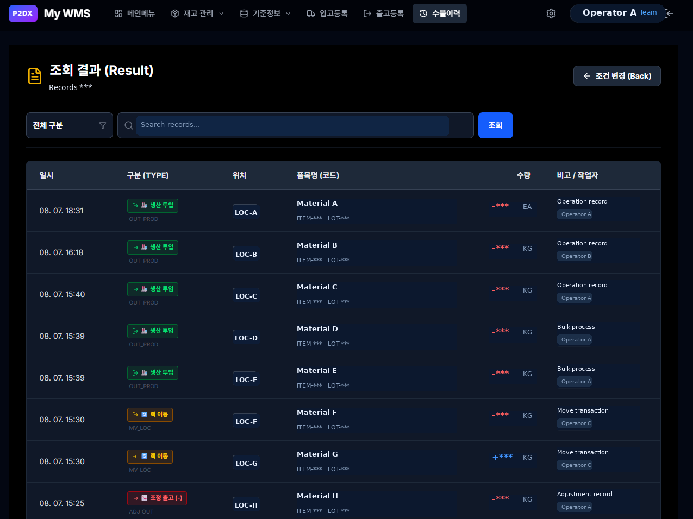

# WMS-001 — QR-Based Warehouse Management System

**Status:** Canonical FORGE Case v0.3 — evidence-backed; first sanitized visual asset committed and integrity-verified  
**Domain:** Warehouse / Inventory / Manufacturing Operations  
**Artifact Type:** Implemented Operational System  
**Primary Role:** Product Owner / System Designer / Business Rule Designer / Implementation Lead  
**Current System Form:** Custom Web Application  
**Case Language:** English-first with selected Korean operational labels

---

## Case at a Glance

| Item | Summary |
|---|---|
| Initial Trigger | Repeated monthly physical inventory count with manual consolidation |
| First Hypothesis | Use QR codes to identify racks and items, then collect counts digitally |
| Early Validation | QR + AppSheet PoC used to validate workflow and data structure |
| Key Constraint Discovered | Multiple simultaneous users exposed spreadsheet-based backend limits |
| Architecture Decision | Move from spreadsheet-centered PoC to custom multi-user web application |
| Core Transaction Model | Location + Item + Lot + Quantity + Transaction Type + Operator + Timestamp |
| Primary Business Rule | Every stock change is recorded as a transaction |
| Operational Integration | Existing company QR conventions reused where possible |
| Current Evidence Level | Operational system with private visual evidence and first public sanitized visual evidence |
| Public Sanitized Visual Evidence | Confirmed — first asset integrity-verified |
| Measured Business Impact | Not Yet Established |

---

# 1. Operational Problem

The warehouse required repeated physical inventory counting and reconciliation.

The original process relied on manual counting and spreadsheet-based consolidation. This created recurring operational friction:

- workers had to identify locations and items manually
- multiple people could count the same or adjacent inventory areas
- results had to be merged after the count
- location, item, lot and quantity context could be entered inconsistently
- traceability depended heavily on spreadsheet discipline
- the process was difficult to scale when several users worked at the same time

The initial question was simple:

> Can warehouse counting and stock movement be made more structured by identifying physical locations and items through QR codes?

This was not initially framed as a full Warehouse Management System.

It began as a narrower attempt to improve a repeated inventory-counting task.

---

# 2. First Hypothesis — QR + AppSheet PoC

The first implementation hypothesis was intentionally lightweight.

```text
Rack QR
→ Item QR
→ Quantity Entry
→ Spreadsheet
```

A QR code was attached to or associated with a warehouse rack/location.

The operator scanned the location, scanned or selected the item, entered quantity, and recorded the result digitally.

AppSheet was used as an early validation layer because it allowed rapid testing of:

- QR-based identification
- mobile data entry
- basic transaction capture
- location/item relationship
- workflow feasibility

The PoC was useful because it tested the operational model before a larger custom system was built.

However, the PoC also exposed an architectural limitation.

---

# 3. Constraint Discovery — Multi-User Operation

The important failure point was not QR scanning itself.

The problem emerged when the workflow moved from a single-user or limited-user test toward simultaneous operational use.

A spreadsheet-centered backend introduced concerns around:

- concurrent updates
- collision risk
- inconsistent write timing
- weak transaction control
- difficult validation
- limited scalability for multi-user operations

The key architectural lesson was:

> A workflow can be validated with a lightweight tool even when that tool is not suitable as the final operational architecture.

The AppSheet implementation was therefore treated as a **PoC and learning stage**, not as the final production architecture.

This distinction is important.

The value of the PoC was not that it became the permanent system.

The value was that it exposed the real business rules and the real architectural constraints early.

---

# 4. Architecture Evolution

The system evolved through three stages.

## Stage 1 — Manual Inventory Process

```text
Physical Count
→ Manual Record
→ Spreadsheet Consolidation
```

Primary weakness:

- repeated manual work
- weak traceability
- inconsistent structure
- difficult multi-user coordination

---

## Stage 2 — QR + AppSheet PoC

```text
Rack QR
→ Item QR
→ Quantity
→ AppSheet
→ Spreadsheet Backend
```

What this stage validated:

- QR identification works operationally
- warehouse workers can interact with location/item identifiers digitally
- inventory data can be structured as transactions
- mobile-first interaction is feasible

What this stage exposed:

- spreadsheet backend limitations
- multi-user concurrency risk
- need for stronger business-rule enforcement
- need for a more explicit transaction model

---

## Stage 3 — Custom Multi-User Web Application

The system moved toward a dedicated web application with a structured backend.

Conceptually:

```text
User
→ Web UI
→ Business Rules
→ API / Application Logic
→ Transaction Store
→ Inventory State
```

The exact production infrastructure is intentionally generalized in this public case.

The important architectural shift was:

> from document-style state storage to transaction-oriented operational logic.

---

# 5. Core Business Rules

The WMS became more reliable when warehouse activity was modeled as explicit business rules rather than as spreadsheet editing.

## 5.1 Transaction-First Inventory Model

The central rule is:

> Every inventory change must be represented as a transaction.

A simplified transaction can be represented as:

```text
Transaction
- timestamp
- operator
- transaction_type
- location
- item
- lot
- quantity
- note
```

The inventory state is therefore derived from transaction history rather than treated only as a manually editable number.

---

## 5.2 Transaction Types

Operational transaction types include concepts such as:

- receipt
- production input
- production output
- movement
- adjustment
- issue / outbound movement

The exact internal naming and codes are generalized here.

The important rule is that different physical events are not treated as the same generic quantity edit.

Each event has operational meaning.

---

## 5.3 Location Identity

A warehouse location is not just free text.

It is treated as an operational entity.

Conceptually:

```text
Warehouse
→ Zone
→ Rack / Location
→ Item / Lot
```

A QR code can represent or resolve a location identifier.

This reduces ambiguity when operators work across multiple physical storage positions.

---

## 5.4 Item Identity

The item must be identifiable independently from the location.

This matters because:

- the same item can exist in multiple locations
- a location can hold different items over time
- inventory movement changes the relationship between item and location

Therefore:

```text
Location Identity ≠ Item Identity
```

The transaction connects them.

---

## 5.5 Lot Tracking

Where lot-level control is required, quantity alone is insufficient.

The operational state becomes closer to:

```text
Location
+ Item
+ Lot
+ Quantity
```

This supports more reliable traceability than item-level totals alone.

---

## 5.6 Movement as Paired State Change

A location movement should not be represented as a simple overwrite.

Conceptually:

```text
Source Location
→ quantity decreases

Destination Location
→ quantity increases
```

Both changes belong to the same operational movement.

This rule improves auditability and makes transaction history meaningful.

---

## 5.7 Adjustment Is Not Normal Movement

Inventory adjustment represents a reconciliation event rather than an ordinary physical flow.

For example:

```text
System Quantity ≠ Physical Quantity
→ Adjustment Transaction
→ Reconciled State
```

Separating adjustment from ordinary receipt, movement or issue makes later analysis more trustworthy.

---

# 6. QR Integration Strategy

One important design choice was to avoid creating an unnecessary parallel identification system.

Where practical, the WMS reused QR conventions already present in the company environment.

This reduced:

- duplicate labels
- operator confusion
- rollout friction
- unnecessary master-data maintenance

The principle was:

> Integrate with existing operational identifiers before inventing new ones.

This is a small design decision with large practical consequences in manufacturing environments.

A technically elegant system can still fail if it creates unnecessary work for operators.

---

# 7. Why the Architecture Changed

The architecture change was not driven by a desire to use more advanced technology.

It was driven by operational constraints.

The reasoning chain was:

```text
Manual process is repetitive
→ QR can reduce identification friction
→ AppSheet can validate the workflow quickly
→ multi-user use exposes backend weakness
→ spreadsheet state is insufficient
→ transaction rules become explicit
→ dedicated application architecture becomes justified
```

This sequence is important because it shows the difference between **technology-first development** and **constraint-driven architecture**.

The final system was not designed first and justified later.

It emerged from progressively better understanding of the operational problem.

---

# 8. Operational Evidence & Impact

The strongest current evidence for this case is the implemented operational system and its associated artifacts.

Confirmed evidence includes:

- a functioning WMS application
- QR-based location and item interaction
- transaction history
- location/rack structures
- operator-facing screens
- role-based or permission-oriented UI concepts
- inventory movement and adjustment workflows
- warehouse/rack visual structures
- first sanitized transaction-history visual evidence committed with exact-byte read-back verification

## First Public Sanitized Visual Evidence



This image is based on an actual operational transaction-history screenshot. Sensitive values were removed before publication, so it is classified as **Sanitized Evidence** rather than a reconstructed public visual derivative.

Repository transport preserved the supplied sanitized asset bytes. The transport process did **not** regenerate, resize, recompress, convert format, or edit metadata.

### Integrity Evidence

| Field | Verified value |
| --- | --- |
| Source size | `128360` bytes |
| Source SHA-256 | `1eafaeea9f7c57873060e93529786a4da8072e1518b26978869e8af8943026cf` |
| Expected Git blob SHA | `72d42e479ea5af9c82a3c6578c7a45f569dca549` |
| Resulting Git blob SHA | `72d42e479ea5af9c82a3c6578c7a45f569dca549` |
| Read-back size | `128360` bytes |
| Read-back SHA-256 | `1eafaeea9f7c57873060e93529786a4da8072e1518b26978869e8af8943026cf` |
| Integrity verified | `true` |
| Evidence commit | `a6ce0bd1bafbdd26a2d478feab94b7473446553a` |

This integrity validation proves a narrow technical fact: the sanitized asset was recorded in Git and read back with bytes matching the verified source. It does **not** newly prove the screenshot's operational meaning, system effectiveness, or business impact.

The first sanitized transaction-history asset now exists in the public repository. Remaining original production deployment, role permission, warehouse map, rack-card, alternate topology and other operational visuals remain **PRIVATE ORIGINAL EVIDENCE**. Only assets that pass sanitization and publication review should be added to the public repository.

### Evidence Interpretation

The system clearly demonstrates implementation capability and operational modeling.

What is not yet established is a measured business impact baseline.

For example, the current repository does not yet contain validated before/after measurements for:

- inventory counting time reduction
- transaction processing time
- inventory accuracy improvement
- error-rate reduction
- labor-hour savings
- financial ROI

These values should not be invented retrospectively.

### Current Impact Classification

**Measured Business Impact:** Not Yet Established

The next evidence step should focus on reconstructing or measuring defensible operational outcomes where possible.

---

# 9. Failure, Constraint and Learning

This case is not presented as a linear success story.

Several constraints materially shaped the system.

## Spreadsheet Backend Limitation

The early AppSheet architecture was useful for validation but weak for simultaneous operational use.

Lesson:

> A low-code PoC can validate business rules without being suitable as the final transactional backend.

---

## Multi-User Concurrency

A process that works for one operator can behave differently when several operators interact with the same state.

Lesson:

> Multi-user behavior is an architectural requirement, not a UI feature.

---

## Transaction Semantics

Inventory systems become fragile when all changes are represented as direct quantity edits.

Lesson:

> Operational meaning should be captured in transaction types and business rules.

---

## Physical-Digital Alignment

Warehouse systems interact with physical labels, racks, lots and operator habits.

Lesson:

> A warehouse application is only as reliable as the mapping between digital state and physical reality.

---

# 10. Reusable Engineering Lessons

Several lessons from this system are reusable beyond warehouse software.

## Validate the Workflow Before Scaling the Architecture

The AppSheet stage was valuable because it made the workflow testable quickly.

The PoC did not need to be the final system to be successful.

---

## Let Constraints Trigger Architecture Changes

The move to a custom web application was justified by multi-user and transaction-control requirements.

Architecture changed because the problem demanded it.

---

## Encode Business Meaning Explicitly

Receipt, movement, adjustment and production events should not collapse into generic quantity edits.

Business semantics belong in the system model.

---

## Reuse Existing Operational Infrastructure

Existing QR conventions were reused where practical.

This reduced deployment friction and unnecessary duplication.

---

## Preserve Transaction History

A trustworthy operational system should make it possible to answer:

- what changed?
- when?
- where?
- by whom?
- for which item or lot?
- through what transaction type?

This is more valuable than simply showing the current number.

---

# 11. Public Evidence Plan

The public evidence strategy is now incremental rather than all-or-nothing.

The first sanitized transaction-history asset has passed publication review and exact-byte repository integrity verification:

- `assets/03-transaction-history.png`

Remaining original evidence is still private and includes candidates such as:

- production deployment view
- role/permission structure
- warehouse map
- rack-card / location view
- alternate topology or operational screens

These should remain **PRIVATE ORIGINAL EVIDENCE** until individually reviewed and sanitized. Additional public assets should be added only after sanitization and publication review, preserving provenance between private source evidence and any public sanitized evidence or derivative.

---

# 12. Relationship to MILES

This case belongs in `FORGE` because it is an implemented operational system.

It also provides evidence for several broader MILES themes:

- field problem → structured system
- PoC → constraint discovery → architecture evolution
- business rules as engineering artifacts
- operational data as a decision layer
- execution systems in manufacturing environments

However, this case should not be retroactively described as the direct predecessor of later MILES ideas such as:

- Docs as Code
- Feature as Code
- Git as Action

Those concepts emerged later.

The WMS is better understood as an early example of a recurring engineering pattern:

> Observe a repeated operational problem, structure the data and rules, validate quickly, then evolve the architecture when constraints become visible.

---

# 13. Next Evidence Steps

Priority follow-up work:

1. review and sanitize an additional 5–7 visual candidates
2. preserve evidence provenance between private originals and public assets
3. document transaction rules more formally if they become reusable
4. reconstruct measurable before/after operational evidence where defensible
5. avoid unsupported ROI or time-saving claims
6. connect later MILES methods only where historical evidence supports the relationship

---

# Summary

WMS-001 began as an attempt to improve repeated warehouse inventory counting through QR-based identification.

A lightweight AppSheet PoC validated the workflow but exposed multi-user and backend constraints.

The system then evolved into a custom multi-user web application built around explicit inventory transactions, location identity, item identity, lot tracking and operational business rules.

The case is now evidence-backed with its first public sanitized transaction-history screenshot committed and exact-byte integrity-verified. The remaining visual evidence is still private pending sanitization and publication review, and measured business impact remains **Not Yet Established**.

The strongest lesson is not the specific technology stack.

It is the architecture evolution:

```text
Manual Work
→ Lightweight Validation
→ Constraint Discovery
→ Explicit Business Rules
→ Dedicated Operational System
→ Sanitized Evidence Publication
→ Verified Repository Memory
```

This makes WMS-001 a useful MILES FORGE case because it shows how a field problem can evolve into a structured execution system while preserving evidence and claim discipline.
